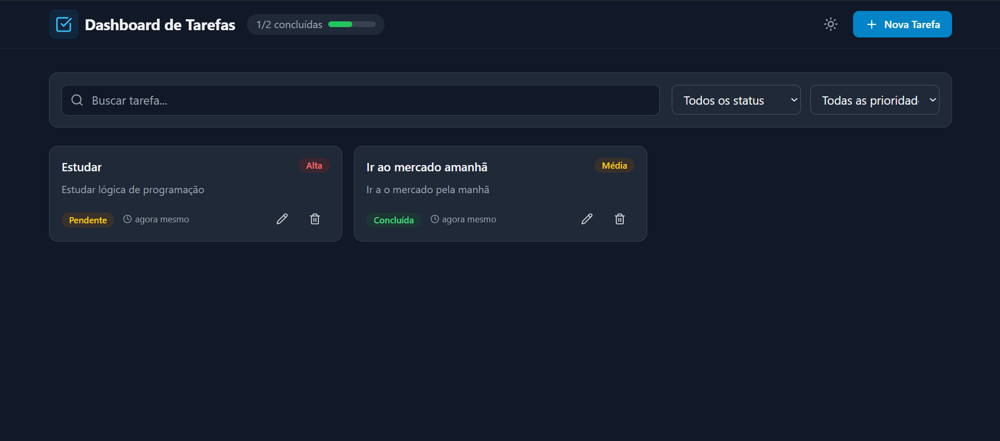

# Task Dashboard

Dashboard de gerenciamento de tarefas desenvolvido para demonstrar habilidades em React moderno.



## Tecnologias Demonstradas

| Tecnologia | Uso no Projeto |
|------------|----------------|
| **React 18** | Biblioteca base |
| **TypeScript** | Tipagem estática |
| **Zustand** | Gerenciamento de estado global (tema, filtros, modal) |
| **TanStack Query** | Cache, mutations, optimistic updates |
| **Framer Motion** | Animações fluidas e transições |
| **React.memo** | Otimização de re-renders |
| **Tailwind CSS** | Estilização utilitária |

## Estrutura do Projeto

```
src/
├── components/
│   ├── layout/          # Header, Footer, etc
│   ├── tasks/           # TaskCard, TaskList, TaskForm, TaskFilters
│   └── ui/              # Button, Input, Modal, Badge, etc (reutilizáveis)
├── hooks/               # Custom hooks (useTasks, useCreateTask, etc)
├── services/            # API simulada
├── stores/              # Zustand stores (theme, filters, modal)
├── types/               # TypeScript types
├── utils/               # Helpers e formatadores
├── App.tsx
└── main.tsx
```

## Features

- ✅ CRUD completo de tasks
- ✅ Filtros por status, prioridade e busca
- ✅ Tema dark/light com persistência
- ✅ Animações de entrada, saída e hover
- ✅ Optimistic updates (delete imediato com rollback)
- ✅ Loading states com skeletons
- ✅ Debounce na busca
- ✅ Responsivo (mobile-first)

## Conceitos Demonstrados

### Zustand (Estado Global)
```typescript
setStatusFilter: (status) =>
  set((state) => ({
    filters: { ...state.filters, status },
  })),
```

### React Query (Cache e Mutations)
```typescript
onMutate: async (deletedId) => {
  const previousTasks = queryClient.getQueryData(taskKeys.all);
  queryClient.setQueryData(taskKeys.all, (old) =>
    old?.filter((task) => task.id !== deletedId)
  );
  return { previousTasks };
},
onError: (err, deletedId, context) => {
  queryClient.setQueryData(taskKeys.all, context.previousTasks);
},
```

### React.memo (Otimização)
```typescript
export const TaskCard = memo(
  function TaskCard({ task, onEdit, onDelete }) { ... },
  (prevProps, nextProps) => {
    return prevProps.task.id === nextProps.task.id &&
           prevProps.task.updatedAt === nextProps.task.updatedAt;
  }
);
```

### Framer Motion (Animações)
```typescript
<AnimatePresence mode="popLayout">
  {tasks.map((task) => (
    <motion.div
      key={task.id}
      layout
      initial={{ opacity: 0, y: 20 }}
      animate={{ opacity: 1, y: 0 }}
      exit={{ opacity: 0, x: -100 }}
    >
      <TaskCard task={task} />
    </motion.div>
  ))}
</AnimatePresence>
```

## Como Rodar

```bash
# Instalar dependências
npm install

# Rodar em desenvolvimento
npm run dev

# Build para produção
npm run build
```

## Decisões Técnicas

1. **API Simulada**: Optei por simular a API com delays para demonstrar loading states reais.

2. **Zustand vs Context**: Escolhi Zustand por sua simplicidade e performance superior em comparação com Context API para estados frequentemente atualizados.

3. **Componentização**: Separei componentes UI genéricos de componentes de feature para máxima reutilização.

4. **Imutabilidade**: Todos os updates de estado usam spread operator ou métodos imutáveis (map, filter).

5. **useCallback/useMemo**: Aplicados estrategicamente onde há benefício real de performance.

## Autor

Desenvolvido por **Ewerton Alves**.
